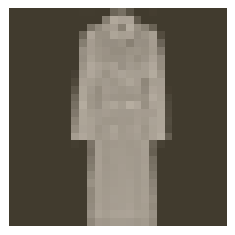
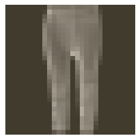
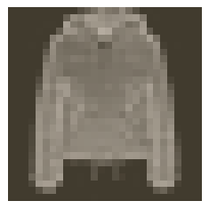
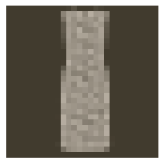

# A QUICK PASS THROUGH BUILDING, TRAINING AND TESTING A NEURAL NETWORK USING THE FASHION MNIST DATA SET

We will use the FashionMNIST dataset from `torchvision` to demonstrate the building, training and testing of neural networks.

Importing our needed libraries
-------------------------------------------


```python
import torch
from torch import nn, optim
from torch.nn import Softmax, LogSoftmax, ReLU
from torchvision import datasets, transforms
from torchvision.datasets import MNIST, FashionMNIST
```

Importing another module created by Udacity for visualizing images, and where applicable, prediction probabilities


```python
import helper
from helper import imshow, view_classify
```

Importing a pytorch wrapper I created to quickly try variations of the model


```python
from quicknets import network
```

Data Acquisition and Preparation for Training and Testing
----------------------------------------------------------------------------------

#### Setting Pipeline for transformations, including normalization.


```python
transform_sequence = transforms.Compose(
    [
        transforms.ToTensor(),
        transforms.Normalize((0.5, 0.5, 0.5), (0.5, 0.5, 0.5))
    ]
)

```

Firstly, We set up a pipeline for preprocessing our data, using `transform.Compose()` from Pytorch's absolutely amazing Computer vision module called `torchvision`. 

`transform.Compose()` allow us to specify a sequence of transformations we want to apply to our image data. 

`transforms.ToTensor()`, first of all, converts images to `torch` tensors, and then normalizes them to `floats` between `0` and `1`. 
>Image data are often processed by `PIL`, a python library for image processing. The outcome of `PIL` processing, is image data in the form of a series of `RGB` values like `(255, 255, 136)`. These numbers are pretty huge, and so we need to convert them into a range from `0` to `1`. We also preserve them as `float`, like `0.200`, so that we do not miss the subtle differences between points like `0.200, 0.203`. This conversion of the `(255, 255, 136)`s to things like `(1.000, 1.000, 0.852)` is what `transforms.ToTensor()` does. Pretty convenient for us all, and it saves us the headache.

`transforms.ToTensor()` normalizes image data to the range `0 - 1`, but often need the range `-1 - 1`. `transforms.Normalize()` does this final change for us, using the means and standard deviations we specify.

#### Loading Training and Testing Datasets

Loading training data:


```python
trainset = FashionMNIST('~/.pytorch/FashionMNIST_data/', download=True, train=True, transform=transform_sequence)
trainloader = torch.utils.data.DataLoader(trainset, batch_size=64, shuffle=True)
```

    Downloading http://fashion-mnist.s3-website.eu-central-1.amazonaws.com/train-images-idx3-ubyte.gz
    Downloading http://fashion-mnist.s3-website.eu-central-1.amazonaws.com/train-labels-idx1-ubyte.gz
    Downloading http://fashion-mnist.s3-website.eu-central-1.amazonaws.com/t10k-images-idx3-ubyte.gz
    Downloading http://fashion-mnist.s3-website.eu-central-1.amazonaws.com/t10k-labels-idx1-ubyte.gz
    Processing...
    Done!


Loading testing data


```python
testset = FashionMNIST('~/.pytorch/FashionMNIST_data/', download=True, train=False, transform=transform_sequence)
testloader = torch.utils.data.DataLoader(testset, batch_size=64, shuffle=True)
```

Setting our loaders as `iterators` so that we can loop through data a step at a time. This is helpful for conserving memory resources. We have huge data, and we cannot afford to load all of them into memory at once. We might hit a memory overflow.

If you were wondering what the need for `batch_size=64` was, as we were declaring `trainloader` and `testloader`, this argument tells the dataloader to only load a batch of image data at a time into memory, so that we do not run into memory exhaustion. You can set it to any value apparently, this time it is `64`, meaning `64` images are loaded into memory for training at a time.

So let's get iterators for `trainloader` and `testloader`.


```python
tr = iter(trainloader)
ts = iter(testloader)
```

Let's confirm our train and test datasets are ready for use. Let's see what's the first image in the first batch of our training and testing datasets.


```python
images, labels = next(tr)
```


```python
images2, labels2 = next(ts)
```

Using `imshow` from the `helper` module to view an image


```python
# from our train set
imshow(images[50])
```


    <matplotlib.axes._subplots.AxesSubplot at 0x7f36a607cda0>





```python
# from our test set
imshow(images2[20])
```


    <matplotlib.axes._subplots.AxesSubplot at 0x7f36a0ce2780>





Setting up our model
------------------------------

We will be using `Sequential` from Pytorch's `nn` module. It's pretty straightforward.


```python
model = nn.Sequential(
    nn.Linear(784, 256),
    nn.ReLU(),
    nn.Linear(256, 128),
    nn.ReLU(),
    nn.Linear(128, 64),
    nn.ReLU(),
    nn.Linear(64, 10),
    nn.LogSoftmax(dim=1)
)
```

`Sequential` allows us to outline the sequence of transformations occuring in the network.

The above Neural Network has one input layer with 784 nodes, two hidden layers using ReLU activation with 128 and 64 nodes respectively, and the output layer having 10 nodes with a softmax activation.

Training the our model
--------------------------------

A model is often useless unless it has learned. This is one of the main strengths of the Deep Learning revolution. Like humans, we often rely on what we have seen or experienced before, to make decisions about the unknown. We will apply this same approach to our model, by showing it patterns of images representing things we will task it to recognize subsequently. 

**What does the training entail?**

When we first learn, we make mistakes. When kids are taught `1 + 1 = 2` in school, they grasp that, and then when you ask `10 + 10`, they get confused. They may say any wrong number, then we tell them its wrong. Models can get confused too, and make wrong decisions...we call them LOSSES. But mistakes are good for everybody if we can learn from them, so we leverage a model's LOSSES to teach it to be better, just like a toddler in school...More emphatically, AIs are like kids anyway..Haha... Thats where the OPTIMIZER comes in. 

The OPTIMIZER tells the model to readjust its reasoning to see a SHIRT as a SHIRT and not a BAG. More like "look at the material it is made of, look at whether it has a sleeve"..."Bags don't have sleeves"...A model reasons through its WEIGHTS and then the GRADIENT DESCENT. So if an OPTIMIZER tells a model to readjust its reasoning, it actually does set a change on the WEIGHTS through the gradients.

**Setting an Optimizer and how will measure Losses**


```python
loss_measure = nn.NLLLoss()
adam = optim.Adam(model.parameters(), lr=0.003)
sgd = optim.SGD(model.parameters(), lr=0.01, momentum=0.9)
```

We are set to train the model. Here again, we often need to go over the same material a number of times to really get it. The same applies to the model. We will let it access the training images a number of times called EPOCHS. So, every complete pass through all the images is an EPOCH. And, for each epoch, we will serve it a little material at a time...in bits...called BATCHES. Let's use 7 EPOCHS


```python
def train(modeL, epochs, optimizer=adam):
    for epoch in range(epochs):
        running_loss = 0
        loss_list = []
        for images, labels in trainloader:

            # we get the class probabilities
            class_probs = modeL(images.view(images.shape[0], -1))

            # we check the losses
            loss = loss_measure(class_probs, labels)

            # we tell the optimizer to forget about the model's previous mistakes
            # and look into the future, for improvements and new readjustments :)
            optimizer.zero_grad()

            # The optimizer tells the model to readjust its reasoning
            loss.backward()
            optimizer.step()

            # We keep monitoring improvements
            running_loss += loss.item()
        else:    
            print(f"Training loss: {running_loss}")
    return modeL   
```


```python
model1 = train(model, 7)
```

    Training loss: 486.79673962295055
    Training loss: 367.07317442446947
    Training loss: 331.57981162518263
    Training loss: 310.6745352894068
    Training loss: 294.54681104421616
    Training loss: 283.3479599058628
    Training loss: 273.801262550056


Testing the model
-------------------------


```python
classes = (
    "T-shirt/top",
    "Trouser",
    "Pullover",
    "Dress",
    "Coat",
    "Sandal",
    "Shirt",
    "Sneaker",
    "Bag",
    "Ankle Boot"
)
```


```python
def classify(img, model):
    im = img.view(img.shape[0], -1)
    out = model1(im)
    
    probs = torch.exp(out)[0].tolist()
    hi_prob = max(probs)
    obj = classes[probs.index(hi_prob)]

    return (
        "==================================\n"
        "{}\n"
        "==================================\n".format(obj.upper())
    )
```


```python
img = images2[0]
imshow(img)
print(classify(img, model))
```

    ==================================
    BAG
    ==================================
    


```python
img = images2[62]
imshow(img)
print(classify(img, model))
```

    ==================================
    COAT
    ==================================
    





```python
img = images2[43]
imshow(img)
print(classify(img, model))
```

    ==================================
    DRESS
    ==================================
    





```python
img = images2[43]
imshow(img)
print(classify(img, model))
```
