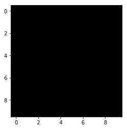
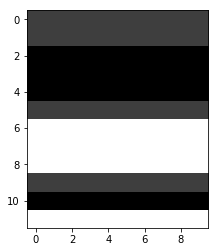

# Demonstrating display patterns of images with monotonous and heterogenous intensities, using gray color map in matplotlib

Victor Mawusi Ayi

A mask obtained using cv2.inrange, where all pixels in the reference image passed, was displayed by `plt.imshow` as black using `cmap="gray"`. The contention was that pixel intensities in the image were all 255. In otherwords, the mask is all white image.

On experimentation, as demonstrated below, the observation was that images with monotonous pixel intensities always got displayed as black by `plt.imshow` and `cmap="gray"`. If we display an image which has all pixel intensities being 150 it will display it as black. Likewise, if we display an image with all its pixels having intensity of 200, it will display as black. If we display an all white image, all pixel intensities are 255, it will still display as black. Once the image has a uniform intensity, like in our case "all white", `plt.imshow()` with `cmap="gray"` displays a black image.

# Understanding the behaviour of plt.imshow(img, cmap="gray")

```python
import matplotlib.pyplot as plt
import numpy as np

import random

%matplotlib inline
```


#### Image with all pixels having intensity of 100


```python
img = [[100 for x in range(10)] for y in range(10)]

# changing to numpy array just for its better display of arrays
# pyplot would still display the image as a regular python list
img = np.array(img)
print(img)

plt.imshow(img, cmap="gray")
```

    [[100 100 100 100 100 100 100 100 100 100]
     [100 100 100 100 100 100 100 100 100 100]
     [100 100 100 100 100 100 100 100 100 100]
     [100 100 100 100 100 100 100 100 100 100]
     [100 100 100 100 100 100 100 100 100 100]
     [100 100 100 100 100 100 100 100 100 100]
     [100 100 100 100 100 100 100 100 100 100]
     [100 100 100 100 100 100 100 100 100 100]
     [100 100 100 100 100 100 100 100 100 100]
     [100 100 100 100 100 100 100 100 100 100]]


    <matplotlib.image.AxesImage at 0x7f6ff8c19550>


#### Image with all pixels having intensity of 255


```python
img = [[255 for x in range(10)] for y in range(10)]

# changing to numpy array just for its better display of arrays
# pyplot would still display the image as a regular python list
img = np.array(img)

print(img)
plt.imshow(img, cmap="gray")
```

    [[255 255 255 255 255 255 255 255 255 255]
     [255 255 255 255 255 255 255 255 255 255]
     [255 255 255 255 255 255 255 255 255 255]
     [255 255 255 255 255 255 255 255 255 255]
     [255 255 255 255 255 255 255 255 255 255]
     [255 255 255 255 255 255 255 255 255 255]
     [255 255 255 255 255 255 255 255 255 255]
     [255 255 255 255 255 255 255 255 255 255]
     [255 255 255 255 255 255 255 255 255 255]
     [255 255 255 255 255 255 255 255 255 255]]


    <matplotlib.image.AxesImage at 0x7f6ff8baae10>





#### Image with all pixels having intensity of 50


```python
img = [[50 for x in range(10)] for y in range(10)]

# changing to numpy array just for its better display of arrays
# pyplot would still display the image as a regular python list
img = np.array(img)

print(img)
plt.imshow(img, cmap="gray")
```

    [[50 50 50 50 50 50 50 50 50 50]
     [50 50 50 50 50 50 50 50 50 50]
     [50 50 50 50 50 50 50 50 50 50]
     [50 50 50 50 50 50 50 50 50 50]
     [50 50 50 50 50 50 50 50 50 50]
     [50 50 50 50 50 50 50 50 50 50]
     [50 50 50 50 50 50 50 50 50 50]
     [50 50 50 50 50 50 50 50 50 50]
     [50 50 50 50 50 50 50 50 50 50]
     [50 50 50 50 50 50 50 50 50 50]]


    <matplotlib.image.AxesImage at 0x7f6ff8b8b128>


#### Image with non-uniform intensities


```python
img = []

for i in (50, 100, 255):
    img += [[i for x in range(10)] for y in range(4)] 

random.shuffle(img)

# changing to numpy array just for its better display of arrays
# pyplot would still display the image as a regular python list
img = np.array(img)
print(img)

plt.imshow(img, cmap="gray")
```

    [[100 100 100 100 100 100 100 100 100 100]
     [100 100 100 100 100 100 100 100 100 100]
     [ 50  50  50  50  50  50  50  50  50  50]
     [ 50  50  50  50  50  50  50  50  50  50]
     [ 50  50  50  50  50  50  50  50  50  50]
     [100 100 100 100 100 100 100 100 100 100]
     [255 255 255 255 255 255 255 255 255 255]
     [255 255 255 255 255 255 255 255 255 255]
     [255 255 255 255 255 255 255 255 255 255]
     [100 100 100 100 100 100 100 100 100 100]
     [ 50  50  50  50  50  50  50  50  50  50]
     [255 255 255 255 255 255 255 255 255 255]]


    <matplotlib.image.AxesImage at 0x7f6ff8ae1780>





```python

```
